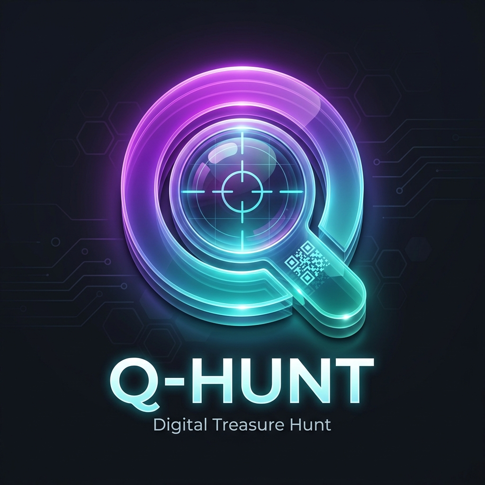

# Q-Hunt 🎯

**Q-Hunt** is a premium, interactive, real-time QR Code Treasure Hunt platform built with Laravel. It allows administrators to orchestrate physical treasure hunts where teams scan hidden QR codes to unlock stages, solve mind-bending puzzles, and race against the clock to top the live leaderboard.



---

## 🌟 Key Features

### For Participants (Teams)
- **Live QR Scanning**: Built-in, browser-based QR scanner using your device's camera.
- **Dynamic Puzzles**: Solve Text, Number, and Multiple-Choice questions to progress.
- **Time-Based Scoring**: Earn maximum points by solving stages quickly. Bonus points are awarded for fast times, and penalties are applied for taking too long.
- **Real-Time Leaderboard**: Watch the live rankings update automatically as teams complete stages.
- **Grand Finale Podium**: A fully animated, immersive podium screen with confetti and music that triggers the moment the Admin finalizes the event.
- **Premium UI/UX**: A dark-mode, glassmorphic design that looks stunning on both desktop and mobile devices.

### For Administrators
- **Event Management**: Create and manage multiple treasure hunt events.
- **Stage Builder**: Define the sequence of locations, base points, and the specific puzzles for each stage.
- **QR Code Generation**: Automatically generates printable QR codes for physical placement at real-world locations.
- **Live Monitoring Dashboard**: Watch the live progress of all teams. See exactly which stage they are on, their current score, and their timeline.
- **Revoke & Reset**: Admins can intervene and revoke points for a specific stage if a team bypassed a physical location or cheated.
- **One-Click Publishing**: Instantly push the live leaderboard or finalize the event, automatically redirecting all active players' screens to the winner's podium.

---

## 🛠️ Technology Stack

- **Backend**: Laravel 11 (PHP)
- **Frontend**: Blade Templates, TailwindCSS v4, Alpine.js
- **Assets**: Vite (for lightning-fast HMR and compilation)
- **Database**: SQLite (Default) / MySQL compatible
- **QR Scanning**: Html5-Qrcode library

---

## 🚀 Installation & Setup

### Prerequisites
Make sure you have the following installed on your machine:
- PHP 8.2+
- Composer
- Node.js (v20+) & NPM

### Step-by-Step Guide
1. **Clone the repository** (if applicable) and navigate to the folder:
   ```bash
   cd "QR Tresure Hunt Management"
   ```

2. **Install PHP Dependencies**:
   ```bash
   composer install
   ```

3. **Install Node Dependencies**:
   ```bash
   npm install
   ```

4. **Environment Setup**:
   Copy the example `.env` file and generate an application key:
   ```bash
   cp .env.example .env
   php artisan key:generate
   ```

5. **Database Migration**:
   Run the migrations to create the database schema:
   ```bash
   php artisan migrate
   ```

6. **Build Frontend Assets**:
   Compile the TailwindCSS styles and JavaScript:
   ```bash
   npm run build
   ```

7. **Start the Local Server**:
   ```bash
   php artisan serve
   ```
   Visit `http://localhost:8000` in your browser!

---

## 📱 Hosting on a Local Network (LAN)

If you are running the game for a local event and want users to connect via their mobile phones without deploying to a live web server:

1. **Find your IPv4 Address**: 
   Open Command Prompt/PowerShell and run `ipconfig`. Find your IPv4 address (e.g., `192.168.1.5`).

2. **Run Laravel bound to your network**:
   ```bash
   php artisan serve --host=0.0.0.0 --port=8000
   ```

3. **Allow through Firewall**:
   Ensure Windows Defender Firewall allows inbound traffic on TCP Port `8000`. You can add the rule via Admin PowerShell:
   ```powershell
   New-NetFirewallRule -DisplayName "Allow Laravel" -Direction Inbound -LocalPort 8000 -Protocol TCP -Action Allow
   ```

4. **Connect**:
   Have players connect to the exact same Wi-Fi network and browse to `http://<YOUR-IP>:8000` (Make sure they type `http://` and not `https://`).

---

## 👨‍💻 Author / Credits
Designed and Developed as a custom Laravel Application for seamless digital treasure hunting.
